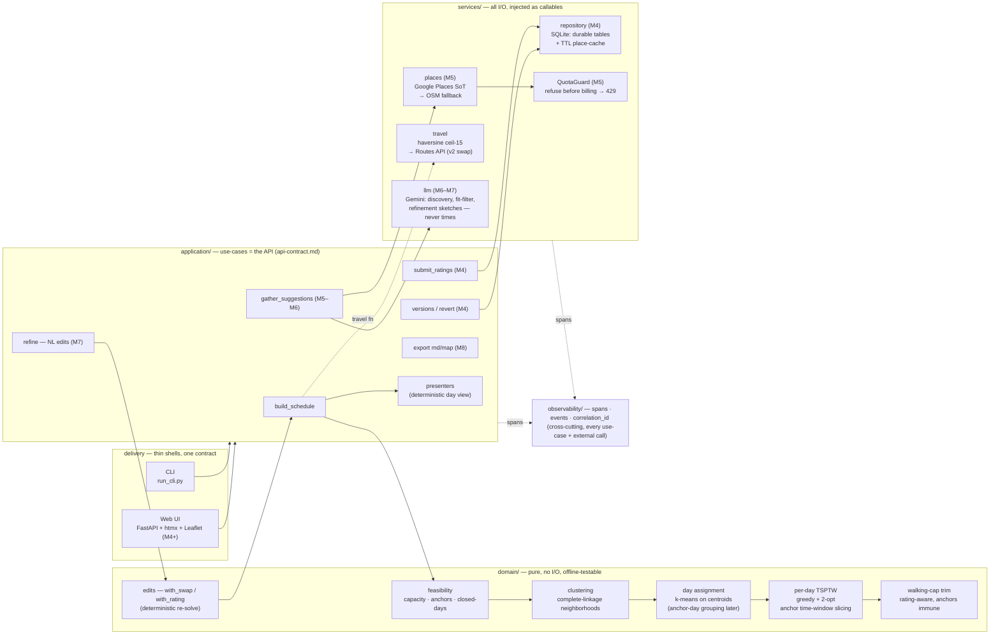

# System Design Doc — AI Travel Itinerary Planner

| | |
|---|---|
| **Status** | draft — open for design review |
| **Date** | 2026-07-02 |
| **Author** | Claude (skills pipeline), for Shirley's review |
| **Reviewers / sign-off** | Shirley — ☐ approved ☐ approved-with-changes |
| **Companions** | PRD [`docs/prd.md`](prd.md) (problem space) · API [`docs/api-contract.md`](api-contract.md) · Standards [`docs/engineering-standards.md`](engineering-standards.md) · ADRs [`docs/decisions/`](decisions/README.md) · Debt [`docs/debt.md`](debt.md) |

**How to review this doc.** §8 (Trade-offs & alternatives) and §13 (Risks / open questions) are the discussion generators — challenge the matrices' scores and the rejected options' whys. §4–§7 are the proposal; if a component table row or flow looks wrong, that's a review finding. Outcomes land in §14 (Review log); architecture-level changes also get an ADR.

**Relationship to the PRD.** The PRD answers *what, for whom, why, and what success means* — invariant across implementations. This doc answers *how, with what structure, within what envelope* — it changes when architecture changes. Requirements live there; contracts, topology, numbers, and trade-offs live here.

**Lifecycle.** Living Gate-1 artifact of `/milestones`. A milestone that shifts anything below updates this file **in the same PR**; deviating without updating it is a sync-pause trigger (implement-task step 1). Superseded text is edited in place — git history is the archive (ADRs are the opposite: append-only, superseded, never rewritten). Milestone-level deltas live in each milestone issue's Design section; task-level notes in sub-issues.

---

## 1. Context & problem statement

A travel itinerary planner: the user names a city, dates, lodging, interests, and pre-booked commitments; the system proposes rated candidate places and **deterministically** routes them into a feasible day-by-day plan the user can re-rank, refine in natural language, and export. The hard problem is not fetching places — it's producing a *trustworthy* schedule: honoring opening hours, visit durations, fixed-time anchors, walking budgets, and partial arrival/departure days, and saying **"this doesn't fit, here's by how much"** instead of silently dropping stops.

## 2. Engineering goals & non-goals

**Goals, in priority order:**
1. The schedule engine is **deterministic and fixture-testable** — the LLM never authors times (same inputs → same plan; re-solve is reproducible).
2. **Infeasibility is a first-class outcome** — explained with numbers, never a crash or a silent drop.
3. **Free-tier operation** — external calls cached, quota-guarded, degradable; ~$0/month ceiling.
4. **Telemetry-diagnosable** — any failure traceable from logs/spans alone, by a human or a coding agent.

**Non-goals:** multi-user/hosted operation (single local user; see §9 for the hosted delta) · provably optimal routes (good-enough heuristic, bounded by problem size) · offline-first (reopening a trip may re-fetch place data by design — see ADR-001/004) · rich client-side state (edits go through deterministic re-solve, ADR-005).

## 3. Glossary (domain language — use these words in code, tests, and reviews)

| Term | Meaning |
|---|---|
| **Place / RankedPlace** | A visitable POI (coords, hours, category, closed weekdays) / that place plus the user's rating (1–5) and optional duration override |
| **Anchor** (`FixedAnchor`) | A pre-booked fixed-time commitment (dinner reservation, timed entry). Seated at exactly its time; everything else routes around it |
| **Area cluster / walking neighborhood** | A set of places where every *pair* is ≤ `walking_neighborhood_min` apart (default 30 min ≈ 2.5 km) — a complete-linkage guarantee; pure geometry, no day concept |
| **Day window** | The schedulable span of one day: `[day_start, day_end]`, narrowed by `arrival_min` (day 1) / `departure_min` (last day) |
| **Walking tolerance / cap** | User multiplier on the daily walking budget: cap = 300 min × tolerance. A *soft* trim target, not an infeasibility |
| **Meal window** | A reserved eating slot; when meal planning is on, one food place is clamped into it |
| **Unscheduled** | Places that fit no day — always returned explicitly, never silently dropped |
| **Feasibility report / pushback** | Pre-build verdict: fits/requested/over_by, anchor conflicts, closed-on-all-days, rendered suggestions. Surfaces as HTTP 409 — an outcome, not an error |
| **TSPTW** | Traveling-salesman-with-time-windows — the per-day routing problem |
| **ScheduleVersion** (M4) | One routed itinerary in a trip's history (last 3 kept, revertable) |

## 4. Architecture

Layered, pure domain core (ADR-002). Dependencies point one way — inward. Travel time enters the domain as an injected `Callable[[Coord, Coord], int]` (ADR-003), rounded UP to 15-min blocks (ADR-007) — the same callable that costs routes also shapes clusters, so cost and geometry never disagree.

### Target-state diagram (milestone tags mark what doesn't exist yet)

The import rule, compactly: `delivery → application → domain ← injected callables ← services`; **no `from tripplanner.services …` inside `domain/`, ever** (ADR-002 calls this the one inviolable rule — worth a CI lint check, currently prose-enforced).

### Component responsibilities

| Module | Owns | May import |
|---|---|---|
| `domain/models.py` | All domain dataclasses; minutes-since-midnight convention | stdlib only |
| `domain/durations.py` | Category default visit durations, per-place override, food categories | models |
| `domain/budgets.py` | Day windows incl. partial first/last days | models |
| `domain/clustering.py` | Complete-linkage proximity clustering — pure geometry, no day concept | models |
| `domain/scheduler.py` | Single-day TSPTW: greedy earliest-finishing + 2-opt; anchor segment slicing; anchor-conflict detection | models, durations |
| `domain/planner.py` | Trip orchestration: cluster → assign days → per-day schedule → meal clamp → cap trim | models, budgets, clustering, durations, scheduler |
| `domain/feasibility.py` | Pre-build verdict: capacity, closed-on-all-days, anchor conflicts | models, planner, scheduler, pushback |
| `domain/pushback.py` | Suggestion-line templating (no LLM, no I/O) | stdlib |
| `domain/edits.py` | `with_swap` / `with_rating` → new Trip (deterministic re-solve inputs) | models |
| `application/build_schedule.py` | Schedule use-case: engine + observability wiring; default travel fn | domain, observability, services |
| `application/presenters.py` | Deterministic day-view rendering, all trip lengths | domain |
| `services/travel.py` | Haversine minutes (ceil-15); swap point for Routes API | domain models only |
| `web/`, `cli.py` | Two bindings of the same use-cases; Pydantic only at the HTTP boundary | application, domain models |
| `observability/` | structlog JSON, OTel spans, correlation context, field schema | stdlib + libs |

Layering rules of thumb: needs `num_days` → planning, not geometry. Renders text → presentation, not engine. Does I/O → services/delivery, never domain. *(Known violation: `pushback.py` templating inside `domain/` — ledgered in debt.md.)*

## 5. Core flows

**Build (POST /schedule → 201):** request schema → `Trip` → `check_feasibility` (may 409) → `build_schedule` (span) → `schedule_trip`: places → walking neighborhoods → k-means neighborhoods onto days (anchors pin day 0 today) → per day: clamp meal picks → TSPTW (greedy + 2-opt; anchored days sliced at each anchor, segments filled) → rating-aware cap trim (anchors immune) → `Itinerary` + `unscheduled` → presenter → response.

**Pushback (409):** `check_feasibility` fails → numbers (`fits`/`requested`/`over_by`), anchor conflicts, closed-all-days, templated suggestions → 409 body → user re-ranks/swaps → rebuild. This is the deterministic loop M7's NL refinement drives.

**Re-solve after edit:** `with_rating`/`with_swap` → new `Trip` → build again; same inputs → same plan (test invariant).

## 6. Data model

**Trip** (dates, lodging, windows, tolerances, meal windows, anchors) → owns **RankedPlace** → wraps **Place**; **FixedAnchor** = Place + fixed arrival + duration. Output: **Itinerary** → **Day** → **ScheduledStop** + `unscheduled`. **FeasibilityReport** is derived, never stored. All frozen dataclasses; times are minutes-since-midnight ints; HH:MM only at the edges.

Lifecycle: request-scoped today (fixtures in, response out). M4 (ADR-004): SQLite — **durable tables** (trips, interests, activations, ranked_places, fixed_anchors, schedule_versions ×3) hold *only user-owned data + `place_id`*; a separate **TTL `place_cache`** holds perishable coords/hours/ratings with `fetched_at`. The Google ToS 30-day caching ban is thereby enforced *structurally* — durable rows cannot contain coordinates. Reopening a stale trip re-fetches (needs network, by design).

## 7. Interface contracts & degradation

`docs/api-contract.md` is the contract: **use-cases = API**, CLI and web are two bindings of the same 12 operations. Status semantics: **409** infeasible-with-numbers (first-class) · **422** semantically invalid · **429** QuotaGuard refused pre-billing · **424/502 → 200 + `outcome: degraded`** when a fallback succeeded. Degradation is visible, never silent.

| Dependency | Arrives | Role | Down / limited → |
|---|---|---|---|
| Google Places (New) | M5 | place facts source of truth | OSM fallback, `outcome: degraded`; both down → 503 |
| OSM / Overpass | M5 | fallback + only durably-cacheable source (ODbL) | per-place `hours_unverified` |
| Gemini | M6–M7 | discovery, fit-filter, refinement *sketches* — never schedule times | curation skipped/cached + banner; engine unaffected |
| QuotaGuard (internal) | M5 | refuse before free-tier billing | 429 with reset info — a feature |
| Ollama | now | build-process task executor, not the product | cloud-tier subagent; zero product impact |

## 8. Trade-offs & alternatives considered ⭐

Core pillars for every matrix, per the engineering goals: **Determinism/testability · Output quality · Complexity (build + operate) · Cost (free-tier ceiling) · Latency**. Scores are honest, not advocacy — challenge them in review. Each decision links its ADR (two were decided in-session and are recorded here pending back-fill ADRs).

### 8.1 Per-day routing engine — [ADR-003](decisions/003-scheduler-heuristic.md)

| Option | Route quality | Determinism | Complexity | Cost | Latency |
|---|---|---|---|---|---|
| **Custom greedy + 2-opt (chosen)** | Good ≤ ~15 stops/day; not provably optimal | Full | Moderate — ~200 lines pure Python, fully debuggable | None | < 100 ms/day |
| OR-Tools CP-SAT | Near-optimal, incl. tricky anchor cases | Full (seeded) | High — heavy C++ dep, steep API, opaque failures | None ($), heavy install | 100 ms–1 s |
| LLM-authored schedule times | Unverifiable; violates goal #1 | **None** | Low code, high prompt fragility | Per-call $ | seconds |

**Why rejected:** OR-Tools — overkill at ≤15 stops and a heavy dependency before the engine even ran end-to-end; the swap stays contained behind the stable `schedule()` signature if an anchor-dense day ever exceeds the heuristic. LLM times — non-deterministic, untestable, and the PRD forbids it. **Revisit trigger:** a real mis-routed anchor-dense day (see §13 OR-Tools threshold question).

### 8.2 Neighborhood clustering — decided M2→M3 in-session (ADR back-fill candidate)

| Option | Pairwise guarantee | Determinism | Complexity | Semantics |
|---|---|---|---|---|
| **Complete-linkage w/ 30-min cutoff (chosen)** | **Yes — every pair ≤ threshold** | Full (explicit tie-breaking) | O(N³) naive — fine ≤ 50 places | Variable cluster count = actual neighborhoods |
| k-means on places (M2 original) | **No** — members can be 60+ min apart if both near centroid | Seeded | O(N·k·iter) | k forced = num_days: conflates geometry with planning |
| Grid / geohash bucketing | No — boundary artifacts split near pairs | Full | O(N) | Crude; cell size arbitrary |

**Why rejected:** k-means was the shipped M2 design and failed the user's semantic test — "A↔B 15 min, A↔C 15 min, B↔C 30 min must split B/C at threshold 15" — k-means cannot express a pairwise constraint. Grid bucketing splits genuinely-walkable pairs at cell borders. The O(N³) cost is a deliberate ceiling (§10 envelope).

### 8.3 Multi-anchor day scheduling — decided M3 in-session (ADR back-fill candidate)

| Option | Zigzag risk | Scheduler changes | Time allocation |
|---|---|---|---|
| **Time-window slicing (chosen)** | None — each segment routed in isolation | None — reuses `schedule()` per segment | Derived from anchor times minus inter-cluster transit |
| Cluster-sequential mini-days | None | None | **Must be guessed upfront** — wrong split strands places |
| Anchor-pinned flat list | **High** — travel-min optimizer may bounce between areas | Significant — needs anti-zigzag constraints | N/A |

**Why rejected:** cluster-sequential requires allocating the day's time across clusters before routing — a guess the anchors already answer; anchor-pinned flat needs new scheduler machinery to prevent the exact pathology it invites.

### 8.4 Place data source — [ADR-001](decisions/001-place-data-source.md)

| Option | Data completeness | Freshness/coverage | Cost | Caching/ToS |
|---|---|---|---|---|
| **Google Places New, LLM curates (chosen)** | Coords + hours + rating + price in one call — only option | Best | ~$0 within free caps (verify pre-M5) | **30-day coord-cache ban** → shapes §6 persistence |
| Gemini w/ Maps grounding as source | **Prose + place IDs only** — no structured coords/hours | High | Bills per grounded prompt *plus* hydration calls | n/a |
| OSM/Overpass (+Foursquare) | Sparse `opening_hours`, no ratings | Patchy | Free | ODbL permits durable caching — kept as the escape hatch |

**Why rejected:** grounding-as-source can't feed a deterministic scheduler (no machine-readable hours) and double-bills; OSM-only fails the "hours drive the routing" requirement — but it stays as the degradation fallback *and* the recorded fallback architecture if Google ToS/cost friction grows.

### 8.5 Persistence — [ADR-004](decisions/004-persistence-sqlite-cache.md)

| Option | ToS compliance | Query/versioning | Ops burden | Offline reopen |
|---|---|---|---|---|
| **SQLite: durable tables + TTL place-cache (chosen)** | **Structural** — durable rows carry `place_id` only | Real SQL; version = 1 JSON row, keep 3 | Zero-config, stdlib, one file | No (re-fetch by design) |
| JSON files per trip | Easy to violate accidentally | None; versioning awkward | Trivial | Yes — but stale silently |
| Postgres | Same as SQLite | Best | **Server to run/migrate/back up — absurd for 1 user** | No |
| Durable full place data | **Violates ADR-001 ban** — rejected outright | — | — | — |

### 8.6 Web delivery — [ADR-005](decisions/005-web-delivery.md)

| Option | Interactivity | Toolchain weight | Fit (learning Python, 1 user, free maps) |
|---|---|---|---|
| **FastAPI + Jinja2/htmx + Leaflet (chosen)** | Partial updates — enough, since edits go through re-solve | None beyond Python | High; Leaflet + OSM tiles = keyless free map |
| FastAPI + React SPA | Richest | Build system, state mgmt, second ecosystem | Low — heavy for v1, splits focus |
| Streamlit | Fast but constrained | None | Poor fit for custom map + bespoke flows |

### 8.7 Compact (one-line whys)

- **Layered over hexagonal** (ADR-002): 4 port interfaces + composition root was ceremony ahead of need; the inviolable import rule preserves the testability guarantee; promote-to-factory when a second impl actually lands.
- **Travel rounding ceil-15 over raw/flat/multiplier** (ADR-007): matches how travelers think, consistent relative buffer, kills false ":03" precision; revisit when Routes API (already buffered) replaces haversine.

## 9. Production readiness & operations

Deployment model today: **single-user local app** (uv-managed venv, `run_cli.py` / `uvicorn`). "Production" = Shirley's machine and data she'd hate to lose. What that requires now, and the delta if it were ever hosted:

| Concern | Now (local, single-user) | Hosted delta (explicit non-goal — recorded so the boundary is a decision) |
|---|---|---|
| Config & secrets | `.env` (gitignored, read-only to agents, never logged); manual key rotation | Secret manager, rotation policy, per-env config |
| Data durability | SQLite in WAL mode; backup = file copy + `trip export` (M8); **migrations = versioned SQL scripts from M4, restore-tested** | Scheduled backups, PITR, staging restore drills |
| Cost control | QuotaGuard refuses pre-billing (429); per-SKU quota config; ~$0 ceiling; costs visible in logs (`quota_remaining`) | Budget alerts, per-user quotas, billing dashboards |
| ToS / licensing | Google 30-day coord ban enforced structurally (§6); OSM ODbL attribution in exports; re-verified at `/audit` | Legal review; rate-limit contracts |
| Reliability | Deterministic engine → crash-safe: any plan rebuilds from inputs; builds idempotent; degradation matrix §7 | HA, health checks, graceful shutdown, retries budget |
| Observability | JSON logs + rotating file, OTel spans, `correlation_id` per run; **bar: diagnosable from telemetry alone**; log rotation caps disk | Centralized sink, alerting, SLO dashboards, on-call runbook |
| Release & upgrade | uv lockfile pins deps; `--version`; DB schema version checked on startup, migrate-forward; rollback = previous install + restored DB file | CI/CD gates, canary, feature flags, rollback automation |
| Supply chain | uv lock, gitleaks pre-commit, no-new-deps-without-surfacing guardrail | SBOM, dependency scanning, provenance |
| Security | Input validation at Pydantic boundary; no secrets in logs; only place queries leave the machine | AuthN/Z, HTTPS, rate limiting, session mgmt, pen test |

## 10. Cross-cutting concerns

- **Error taxonomy:** user-fixable infeasibility → 409 report · invalid input → 422 · internal invariant violations → `raise RuntimeError` with diagnostic (never `assert`; `-O` strips it) · doesn't-fit → `unscheduled`, never dropped. Retries (tenacity, backoff+jitter) only at external-call boundaries.
- **Performance envelope (designed-for numbers, renegotiated here in a PR when M5 changes N):** ≤ ~50 candidate places/trip, ≤ ~15/day, ≤ 14 days; `POST /schedule` p95 < 2 s at that scale. Known super-linear spots are deliberate ceilings with promotion triggers in debt.md: cap-trim O(N²) schedules/day, feasibility double-build, complete-linkage O(N³).
- **Security & privacy:** no secrets/keys/full prompts in logs; gitleaks; `.env` read-only; place queries are the only user data leaving the machine (M5+).

## 11. Testing strategy

Exit-criteria tests written and committed **before** feature code each milestone; immutable without user approval — they are the spec. Engine tests deterministic and fixture-built: travel injected as a grid function so assertions are exact; **no network in the suite**. Every public function/endpoint: happy + failure path; every bug fix: a regression test that fails on the old code. Coverage floor 70% (CI-gated) — a consequence, never a target. Verify line (single source, CLAUDE.md § Conventions): `uv run ruff check && uv run mypy && uv run pytest -q`.

## 12. Risks & mitigations

- ~~Heuristic can't route well~~ — retired M1–M3 (exit criteria green on fixtures).
- **Free-tier quota blowout at real data (M5)** — QuotaGuard pre-billing refusal; TTL cache; OSM fallback, visible degradation.
- **LLM curation quality (M6)** — advisory over structured facts (ADR-001); `reasoning` exposed; engine unaffected by LLM failure.
- **Anchors are single-day (M3 scope)** — multi-day trips seat anchors on day 0 only; anchor-day grouping designed (anchors define day structure; k-means becomes unanchored fallback), unbuilt. Revisit M4/M7.
- **SQLite migrations (M4)** — first durable state; migration + restore story must exist *before* real trips do.

## 13. Open questions (pre-seeded review agenda)

1. Should the 409 gate fire on feasible-but-cap-trimmed trips? The walking cap is a *soft preference*; currently trimming triggers pushback (PR #33 finding). **Recommend:** 409 only for hard infeasibility (anchors/closed/over-capacity), 201 + trim report otherwise.
2. `FixedAnchor` carries no date — when do multi-day anchor trips become real (M7 at the latest)? Decides whether anchor-day grouping lands in M4 or M7.
3. OR-Tools swap trigger — define the measurable threshold (e.g., N mis-routed anchor-dense fixture days) rather than "if it feels bad" (ADR-003 left it open).
4. `PUT /trips/{id}/ratings` — deferred to M4 (needs a Trip that outlives one request).
5. Back-fill ADRs for §8.2 (clustering) and §8.3 (anchor slicing)? Both were genuine forks decided in-session.
6. CI lint for the domain-import rule (ADR-002's "inviolable rule" is currently prose-enforced).

## 14. Review log

| Date | Attendees | Decisions | Follow-ups |
|---|---|---|---|
| — | — | *(filled during design review)* | — |
